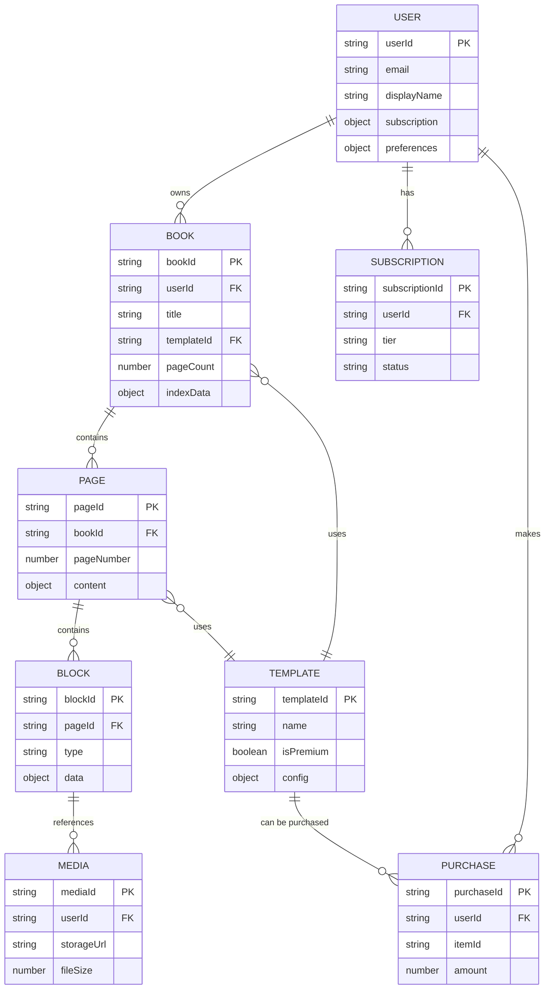
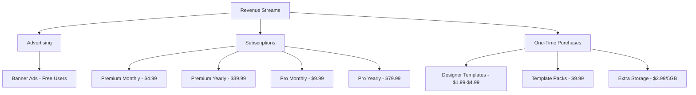

# OBooks - Complete Product Design & Architecture Document

## Executive Summary

OBooks is a digital notebook/book-creation app that combines the tactile experience of physical notebooks with the flexibility of digital tools. It allows users to create realistic digital books with various page templates, flexible content blocks, intelligent shortcuts, and automatic indexing.

**Core Value Proposition:**
- Realistic notebook experience with fixed pages and lines
- Flexible content blocks that work across all page types
- Intelligent shortcuts for rapid content creation
- Automatic index generation and management
- Cross-device cloud synchronization (mobile, web, iPad)
- iPad-optimized with Apple Pencil support
- Freemium business model with premium features

---

## 1. Complete App Architecture

### 1.1 High-Level Architecture

```
┌─────────────────────────────────────────────────────────────┐
│                     PRESENTATION LAYER                       │
│  ┌──────────────┐  ┌──────────────┐  ┌──────────────┐      │
│  │   Flutter    │  │   Flutter    │  │   Flutter    │      │
│  │   Mobile     │  │     Web      │  │     iPad     │      │
│  │  (iOS/And.)  │  │  (Primary)   │  │  (Optimized) │      │
│  └──────────────┘  └──────────────┘  └──────────────┘      │
│                                                              │
│  Desktop (macOS/Windows/Linux) - Phase 2                    │
└─────────────────────────────────────────────────────────────┘
                            ↓
┌─────────────────────────────────────────────────────────────┐
│                    APPLICATION LAYER                         │
│  ┌──────────────┐  ┌──────────────┐  ┌──────────────┐      │
│  │   Book       │  │    Page      │  │   Block      │      │
│  │   Manager    │  │   Editor     │  │   System     │      │
│  └──────────────┘  └──────────────┘  └──────────────┘      │
│  ┌──────────────┐  ┌──────────────┐  ┌──────────────┐      │
│  │  Shortcut    │  │    Index     │  │   Template   │      │
│  │   Parser     │  │  Generator   │  │   Manager    │      │
│  └──────────────┘  └──────────────┘  └──────────────┘      │
└─────────────────────────────────────────────────────────────┘
                            ↓
┌─────────────────────────────────────────────────────────────┐
│                     BUSINESS LAYER                           │
│  ┌──────────────┐  ┌──────────────┐  ┌──────────────┐      │
│  │    User      │  │  Subscription│  │   Content    │      │
│  │   Service    │  │   Service    │  │   Service    │      │
│  └──────────────┘  └──────────────┘  └──────────────┘      │
│  ┌──────────────┐  ┌──────────────┐  ┌──────────────┐      │
│  │    Sync      │  │   Analytics  │  │     Ad       │      │
│  │   Service    │  │   Service    │  │   Service    │      │
│  └──────────────┘  └──────────────┘  └──────────────┘      │
└─────────────────────────────────────────────────────────────┘
                            ↓
┌─────────────────────────────────────────────────────────────┐
│                      DATA LAYER                              │
│  ┌──────────────┐  ┌──────────────┐  ┌──────────────┐      │
│  │  Firestore   │  │   Firebase   │  │   Firebase   │      │
│  │   Database   │  │   Storage    │  │     Auth     │      │
│  └──────────────┘  └──────────────┘  └──────────────┘      │
│  ┌──────────────┐  ┌──────────────┐                        │
│  │    Local     │  │    Cache     │                        │
│  │   Storage    │  │   Manager    │                        │
│  └──────────────┘  └──────────────┘                        │
└─────────────────────────────────────────────────────────────┘
```

### 1.2 Core Components

#### Book Manager
- Create, read, update, delete books
- Manage book metadata (title, template, page count, creation date)
- Handle book-level operations (duplicate, archive, export)

#### Page Editor
- Render pages with appropriate templates (ruled, unruled, grid, dot, hybrid)
- Handle text input (typing, handwriting, voice, paste)
- Manage cursor position and line tracking
- Handle pagination and content overflow

#### Block System
- Insert, move, resize, delete blocks
- Render different block types with appropriate styling
- Handle content wrapping around blocks
- Maintain block positioning relative to lines

#### Shortcut Parser
- Detect two-key commands at line start
- Transform shortcuts into appropriate blocks
- Provide real-time feedback during typing

#### Index Generator
- Automatically detect H1/H2/H3 headers
- Build hierarchical index structure
- Update page numbers dynamically
- Create clickable links to pages

#### Template Manager
- Provide built-in templates
- Load premium templates
- Allow custom template creation (Phase 2)

---

## 2. Screen Flow & UI Wireframes

### 2.1 App Navigation Structure

```
┌─────────────────────────────────────────────────────────────┐
│                      SPLASH SCREEN                           │
│                    (App Logo + Loading)                      │
└─────────────────────────────────────────────────────────────┘
                            ↓
┌─────────────────────────────────────────────────────────────┐
│                   AUTH SCREEN (if not logged in)             │
│              [Sign In] [Sign Up] [Guest Mode]                │
└─────────────────────────────────────────────────────────────┘
                            ↓
┌─────────────────────────────────────────────────────────────┐
│                     LIBRARY SCREEN (Home)                    │
│  ┌───────────────────────────────────────────────────────┐  │
│  │  [My Books]  [Templates]  [Archived]  [Settings]     │  │
│  └───────────────────────────────────────────────────────┘  │
│  ┌─────────┐  ┌─────────┐  ┌─────────┐  ┌─────────┐       │
│  │  Book 1 │  │  Book 2 │  │  Book 3 │  │   [+]   │       │
│  │  Cover  │  │  Cover  │  │  Cover  │  │   New   │       │
│  └─────────┘  └─────────┘  └─────────┘  └─────────┘       │
│                                                              │
│  [Banner Ad - Small, Bottom]                                │
└─────────────────────────────────────────────────────────────┘
                            ↓
┌─────────────────────────────────────────────────────────────┐
│                  TEMPLATE SELECTION SCREEN                   │
│  ┌───────────────────────────────────────────────────────┐  │
│  │  Choose Template:                                     │  │
│  │  ○ Ruled    ○ Unruled   ○ Grid   ○ Dot               │  │
│  │  ○ Study    ○ Diary     ○ Planner                    │  │
│  │  ○ Creative (Premium 👑)                              │  │
│  └───────────────────────────────────────────────────────┘  │
│  ┌───────────────────────────────────────────────────────┐  │
│  │  Book Title: [________________]                       │  │
│  │  Page Count: [50 ▼]                                   │  │
│  │                                                        │  │
│  │              [Cancel]  [Create Book]                  │  │
│  └───────────────────────────────────────────────────────┘  │
└─────────────────────────────────────────────────────────────┘
                            ↓
┌─────────────────────────────────────────────────────────────┐
│                      BOOK VIEWER SCREEN                      │
│  ┌───────────────────────────────────────────────────────┐  │
│  │  [<] Book Title                    [⋮ Menu]  [Edit]  │  │
│  └───────────────────────────────────────────────────────┘  │
│  ┌──────────────────────┐  ┌──────────────────────┐        │
│  │                      │  │                      │        │
│  │    LEFT PAGE         │  │    RIGHT PAGE        │        │
│  │    (Page 2)          │  │    (Page 3)          │        │
│  │                      │  │                      │        │
│  │                      │  │                      │        │
│  └──────────────────────┘  └──────────────────────┘        │
│  ┌───────────────────────────────────────────────────────┐  │
│  │  [◄ Prev]    Page 2-3 of 50    [Next ►]              │  │
│  └───────────────────────────────────────────────────────┘  │
└─────────────────────────────────────────────────────────────┘
                            ↓
┌─────────────────────────────────────────────────────────────┐
│                    PAGE EDITOR SCREEN                        │
│  ┌───────────────────────────────────────────────────────┐  │
│  │  [<] Page 5/50    [Shortcuts] [Insert] [⋮]           │  │
│  └───────────────────────────────────────────────────────┘  │
│  ┌───────────────────────────────────────────────────────┐  │
│  │  ─────────────────────────────────────────────────    │  │
│  │  My Chapter Title (H1)                                │  │
│  │  ─────────────────────────────────────────────────    │  │
│  │  Introduction (H2)                                    │  │
│  │  ─────────────────────────────────────────────────    │  │
│  │  This is some text content that follows the ruled    │  │
│  │  ─────────────────────────────────────────────────    │  │
│  │  lines of the page. When I type more content, it     │  │
│  │  ─────────────────────────────────────────────────    │  │
│  │  automatically wraps to the next line.               │  │
│  │  ─────────────────────────────────────────────────    │  │
│  │  [Cursor blinking here]                              │  │
│  │  ─────────────────────────────────────────────────    │  │
│  └───────────────────────────────────────────────────────┘  │
│  ┌───────────────────────────────────────────────────────┐  │
│  │  [🎤 Voice] [✏️ Draw] [📷 Image] [⌨️ Type]            │  │
│  └───────────────────────────────────────────────────────┘  │
└─────────────────────────────────────────────────────────────┘
```

### 2.2 Detailed Screen Descriptions

#### Library Screen
**Purpose:** Main hub for accessing all books

**Elements:**
- Top navigation tabs: My Books, Templates, Archived, Settings
- Grid/List view of books with cover thumbnails
- Each book shows: Cover, Title, Last modified date, Page count
- Floating action button (+) to create new book
- Search bar to filter books
- Sort options (Recent, Alphabetical, Custom)
- Small banner ad at bottom (non-intrusive)

**Interactions:**
- Tap book → Open Book Viewer
- Long press book → Options (Rename, Duplicate, Archive, Delete, Export)
- Tap (+) → Template Selection
- Swipe down → Refresh/Sync

#### Template Selection Screen
**Purpose:** Choose template and configure new book

**Elements:**
- Template preview cards with visual examples
- Free templates: Ruled, Unruled, Grid, Dot, Basic Study/Diary
- Premium templates: Advanced Study, Creative, Designer themes (with 👑 icon)
- Book title input field
- Page count selector (20, 50, 100, 150, 200, Custom)
- Create/Cancel buttons

**Interactions:**
- Tap template → Select (highlight border)
- Tap premium template (if not subscribed) → Upgrade prompt
- Enter title and page count
- Tap Create → Generate book and open to page 1

#### Book Viewer Screen
**Purpose:** Read-only view of book with page-turning experience

**Elements:**
- Two-page spread (like an open book)
- Page numbers at bottom
- Navigation arrows (Previous/Next)
- Top bar: Back button, Book title, Menu (⋮), Edit button
- Realistic page shadows and binding in center

**Interactions:**
- Swipe left/right → Turn pages
- Tap page → Enter Page Editor
- Tap Edit → Enter Page Editor on current page
- Pinch to zoom (for reading)
- Menu options: Book Info, Table of Contents (Index), Export, Share

#### Page Editor Screen
**Purpose:** Active editing interface for a single page

**Elements:**
- Full-screen page with appropriate template (lines, grid, dots)
- Cursor/caret for text input
- Toolbar at bottom: Voice input, Drawing, Image insert, Keyboard
- Top bar: Back, Page number, Shortcuts reference, Insert menu, Options
- Visual indicators for blocks (subtle borders when editing)
- Line numbers (optional, in settings)

**Interactions:**
- Tap anywhere → Place cursor, show keyboard
- Type text → Follows lines, wraps automatically
- Type shortcut (H1, T1, etc.) → Transform to block
- Tap Insert → Show block insertion menu
- Swipe left/right → Navigate to adjacent pages
- Two-finger tap → Undo/Redo
- Long press → Select text, show context menu

---

## 3. Page Editor Design (Detailed)

### 3.1 Line System Architecture

Each page template defines a **line grid** that governs text placement:

```
Page Dimensions: 
- Width: 100% of screen (minus margins)
- Height: Fixed based on template (e.g., 1200px equivalent)
- Margins: Top (60px), Bottom (60px), Left (40px), Right (40px)

Line Properties:
- Line Height: 32px (adjustable per template)
- Line Spacing: 8px between baselines
- Lines per Page: (Page Height - Top Margin - Bottom Margin) / Line Height
  Example: (1200 - 60 - 60) / 32 = 33 lines per page

Line Types:
1. Ruled: Horizontal lines (visible)
2. Unruled: Invisible lines (text still aligns)
3. Grid: Horizontal + vertical lines
4. Dot: Dots at intersections
5. Hybrid: Custom combinations
```

### 3.2 Text Rendering System

**Text-to-Line Mapping:**

```
┌─────────────────────────────────────────────────────────────┐
│  Line 1:  [Chapter One                                    ] │
│  ─────────────────────────────────────────────────────────  │
│  Line 2:  [                                               ] │
│  ─────────────────────────────────────────────────────────  │
│  Line 3:  [This is the beginning of my story. It started ] │
│  ─────────────────────────────────────────────────────────  │
│  Line 4:  [on a cold winter morning when I discovered    ] │
│  ─────────────────────────────────────────────────────────  │
│  Line 5:  [something amazing in my backyard.             ] │
│  ─────────────────────────────────────────────────────────  │
```

**Key Principles:**
1. **Fixed Lines:** Each page has exactly N lines (e.g., 33)
2. **Character Limit per Line:** Calculated based on font size and page width
   - Example: 12pt font, 320px usable width = ~60 characters per line
3. **Word Wrapping:** Words wrap to next line if they exceed line width
4. **No Orphan Lines:** Headings stay with following content (minimum 2 lines together)
5. **Overflow Handling:** When line 33 is full, content flows to next page

### 3.3 Block System Integration

**Block Positioning:**

Blocks occupy one or more complete lines. When a block is inserted:

```
Before Block Insertion:
┌─────────────────────────────────────────────────────────────┐
│  Line 1:  [Introduction                                   ] │
│  ─────────────────────────────────────────────────────────  │
│  Line 2:  [This chapter covers the basics of the topic.  ] │
│  ─────────────────────────────────────────────────────────  │
│  Line 3:  [We will explore several key concepts.         ] │
│  ─────────────────────────────────────────────────────────  │
│  Line 4:  [Let's begin with definitions.                 ] │
│  ─────────────────────────────────────────────────────────  │
└─────────────────────────────────────────────────────────────┘

After Inserting Table Block (3 lines tall):
┌─────────────────────────────────────────────────────────────┐
│  Line 1:  [Introduction                                   ] │
│  ─────────────────────────────────────────────────────────  │
│  Line 2:  [This chapter covers the basics of the topic.  ] │
│  ─────────────────────────────────────────────────────────  │
│  ┌──────────────────────────────────────────────────────┐  │
│  │  Term          │  Definition                         │  │ Line 3-5
│  │  Concept A     │  Description here                   │  │ (Table Block)
│  │  Concept B     │  Description here                   │  │
│  └──────────────────────────────────────────────────────┘  │
│  ─────────────────────────────────────────────────────────  │
│  Line 6:  [We will explore several key concepts.         ] │
│  ─────────────────────────────────────────────────────────  │
│  Line 7:  [Let's begin with definitions.                 ] │
│  ─────────────────────────────────────────────────────────  │
└─────────────────────────────────────────────────────────────┘
```

**Block Types and Line Consumption:**

| Block Type | Min Lines | Max Lines | Resizable |
|------------|-----------|-----------|-----------|
| Heading (H1) | 1 | 2 | No |
| Heading (H2) | 1 | 1 | No |
| Heading (H3) | 1 | 1 | No |
| Text | 1 | Unlimited | Auto |
| Bulleted List | 2 | Unlimited | Auto |
| Numbered List | 2 | Unlimited | Auto |
| Table | 3 | 15 | Yes |
| Diagram/Drawing | 4 | 20 | Yes |
| Blank Space | 1 | 10 | Yes |
| Checklist | 2 | Unlimited | Auto |
| Image | 3 | 15 | Yes |
| Divider | 1 | 1 | No |

### 3.4 Pagination Logic

**Content Flow Algorithm:**

```
1. User types text on Page N
2. Calculate characters per line (based on font, width)
3. Distribute text across lines:
   - Line 1: Characters 1-60
   - Line 2: Characters 61-120
   - ...
   - Line 33: Characters 1921-1980
4. If text exceeds Line 33:
   - Overflow content → Page N+1, Line 1
   - Show "Continued on next page" indicator
5. If block is inserted:
   - Reserve required lines for block
   - Push subsequent content down
   - If content pushed beyond Line 33 → Flow to next page
6. If block is deleted:
   - Pull content from next page to fill empty lines
```

**Page Overflow Indicator:**

```
┌─────────────────────────────────────────────────────────────┐
│  Line 31: [and this is how the story continues into the  ] │
│  ─────────────────────────────────────────────────────────  │
│  Line 32: [next chapter of our journey through time and  ] │
│  ─────────────────────────────────────────────────────────  │
│  Line 33: [space, discovering new worlds and...          ] │
│  ─────────────────────────────────────────────────────────  │
│                                                   [Cont. →] │
└─────────────────────────────────────────────────────────────┘
```

### 3.5 Input Methods

**1. Typing (Keyboard)**
- Standard text input
- Cursor follows current line
- Auto-wrap at line end
- Shortcut detection at line start

**2. Handwriting (Stylus)**
- Ink layer over page
- Handwriting recognition (optional, converts to text)
- Raw ink preservation (for signatures, sketches)
- Pressure sensitivity support

**3. Voice Dictation**
- Real-time speech-to-text
- Punctuation commands ("period", "comma")
- Auto-capitalization
- Pause detection for line breaks

**4. Copy-Paste**
- Paste plain text → Flows into lines
- Paste rich text → Convert to blocks (tables, lists, headings)
- Paste images → Insert as image block
- Smart formatting detection

---

## 4. Shortcut Commands Map

### 4.1 Complete Shortcut List

| Shortcut | Full Command | Result | Lines Used |
|----------|--------------|--------|------------|
| `H1` | Header 1 | Large heading, bold, auto-indexed | 2 |
| `H2` | Header 2 | Medium heading, bold, auto-indexed | 1 |
| `H3` | Header 3 | Small heading, bold, auto-indexed | 1 |
| `T1` | Table 1 | Insert 2x2 table | 3 (default) |
| `T2` | Table 2 | Insert 3x3 table | 4 (default) |
| `T3` | Table 3 | Insert 4x4 table | 5 (default) |
| `D1` | Diagram 1 | Insert small drawing box | 4 |
| `D2` | Diagram 2 | Insert medium drawing box | 8 |
| `D3` | Diagram 3 | Insert large drawing box | 12 |
| `L1` | List 1 | Bulleted list | 2+ (auto) |
| `L2` | List 2 | Numbered list | 2+ (auto) |
| `L3` | List 3 | Checklist | 2+ (auto) |
| `B1` | Blank 1 | Small blank space | 2 |
| `B2` | Blank 2 | Medium blank space | 4 |
| `B3` | Blank 3 | Large blank space | 6 |
| `I1` | Image 1 | Insert image placeholder | 4 |
| `HR` | Horizontal Rule | Insert divider line | 1 |
| `Q1` | Quote 1 | Insert quote block | 2+ (auto) |
| `C1` | Code 1 | Insert code block (monospace) | 3+ (auto) |

### 4.2 Shortcut Detection Logic

**Trigger Conditions:**
1. Cursor is at the beginning of a line (column 0)
2. User types two characters
3. User presses Space or Enter
4. System checks if characters match shortcut pattern

**Example Flow:**

```
User Action:          System Response:
─────────────────────────────────────────────────────────
Types "H"            → Wait for next character
Types "1"            → Detect potential "H1" shortcut
Types Space          → Confirm shortcut
                     → Delete "H1 " from line
                     → Insert H1 heading block
                     → Place cursor in heading
                     → Show "H1 Heading" placeholder
```

**Cancellation:**
- If user types Backspace before Space/Enter → Cancel detection
- If characters don't match any shortcut → Treat as normal text

### 4.3 Shortcut Customization (Phase 2)

Users can customize shortcuts in Settings:
- Remap existing shortcuts
- Create new shortcuts for frequently used blocks
- Import/export shortcut profiles
- Disable shortcuts entirely

---

## 5. Database Schema

### 5.1 Firestore Collections Structure

```
users/
  {userId}/
    - email: string
    - displayName: string
    - photoURL: string
    - createdAt: timestamp
    - subscription: object
      - tier: "free" | "premium" | "pro"
      - startDate: timestamp
      - endDate: timestamp
      - autoRenew: boolean
    - preferences: object
      - defaultTemplate: string
      - defaultPageCount: number
      - shortcuts: map<string, string>
    - stats: object
      - totalBooks: number
      - totalPages: number
      - storageUsed: number (bytes)

books/
  {bookId}/
    - userId: string (indexed)
    - title: string
    - templateId: string
    - coverImageUrl: string
    - pageCount: number
    - currentPage: number
    - createdAt: timestamp
    - updatedAt: timestamp
    - lastOpenedAt: timestamp
    - isArchived: boolean
    - isPremium: boolean
    - tags: array<string>
    - indexData: object
      - entries: array<IndexEntry>
        - title: string
        - level: 1 | 2 | 3
        - pageNumber: number
        - lineNumber: number
        - children: array<IndexEntry>

pages/
  {pageId}/
    - bookId: string (indexed)
    - pageNumber: number (indexed)
    - templateId: string
    - content: object
      - lines: array<Line>
        - lineNumber: number
        - text: string
        - blockId: string | null
        - formatting: object
          - bold: boolean
          - italic: boolean
          - fontSize: number
          - color: string
      - blocks: array<Block>
        - blockId: string
        - type: string (heading, table, diagram, etc.)
        - startLine: number
        - endLine: number
        - data: object (type-specific)
    - metadata: object
      - wordCount: number
      - characterCount: number
      - hasImages: boolean
      - hasDrawings: boolean
    - createdAt: timestamp
    - updatedAt: timestamp

blocks/
  {blockId}/
    - pageId: string (indexed)
    - bookId: string (indexed)
    - type: string
    - startLine: number
    - endLine: number
    - data: object
      # For Table:
      - rows: number
      - cols: number
      - cells: array<array<string>>
      # For Image:
      - imageUrl: string
      - width: number
      - height: number
      - caption: string
      # For Diagram:
      - drawingData: string (SVG or path data)
      - backgroundColor: string
      # For List:
      - items: array<string>
      - style: "bullet" | "number" | "checkbox"
      - checked: array<boolean> (for checklists)
    - createdAt: timestamp
    - updatedAt: timestamp

templates/
  {templateId}/
    - name: string
    - category: "ruled" | "unruled" | "grid" | "dot" | "hybrid" | "study" | "diary" | "planner" | "creative"
    - isPremium: boolean
    - price: number (for one-time purchase templates)
    - previewImageUrl: string
    - config: object
      - lineHeight: number
      - lineColor: string
      - lineStyle: "solid" | "dashed" | "dotted"
      - backgroundColor: string
      - marginTop: number
      - marginBottom: number
      - marginLeft: number
      - marginRight: number
      - gridSize: number (for grid/dot templates)
      - customElements: array<object> (headers, footers, etc.)
    - createdAt: timestamp
    - downloads: number

media/
  {mediaId}/
    - userId: string (indexed)
    - bookId: string (indexed)
    - pageId: string (indexed)
    - type: "image" | "drawing" | "audio"
    - storageUrl: string
    - thumbnailUrl: string
    - fileSize: number
    - mimeType: string
    - createdAt: timestamp

subscriptions/
  {subscriptionId}/
    - userId: string (indexed)
    - tier: "premium" | "pro"
    - status: "active" | "canceled" | "expired"
    - startDate: timestamp
    - endDate: timestamp
    - autoRenew: boolean
    - paymentMethod: string
    - amount: number
    - currency: string
    - createdAt: timestamp
    - updatedAt: timestamp

purchases/
  {purchaseId}/
    - userId: string (indexed)
    - type: "template" | "book_export" | "storage"
    - itemId: string
    - amount: number
    - currency: string
    - status: "completed" | "pending" | "refunded"
    - createdAt: timestamp
```

### 5.2 Data Relationships



### 5.3 Indexing Strategy

**Composite Indexes:**
```
books:
  - userId + updatedAt (DESC)
  - userId + isArchived + updatedAt (DESC)
  - userId + isPremium

pages:
  - bookId + pageNumber (ASC)

blocks:
  - pageId + startLine (ASC)
  - bookId + type

media:
  - userId + createdAt (DESC)
  - bookId + pageId
```

---

## 6. Cloud Storage Structure

### 6.1 Firebase Storage Organization

```
/users/
  /{userId}/
    /profile/
      avatar.jpg
    /books/
      /{bookId}/
        cover.jpg
        /pages/
          /{pageId}/
            /images/
              image_001.jpg
              image_002.png
            /drawings/
              drawing_001.svg
              drawing_002.svg
            /audio/
              voice_note_001.m4a
        /exports/
          book_export_pdf_20231130.pdf
          book_export_epub_20231130.epub

/templates/
  /premium/
    /{templateId}/
      preview.jpg
      config.json
  /free/
    /{templateId}/
      preview.jpg
      config.json

/system/
  /defaults/
    default_cover.jpg
    placeholder_image.png
```

### 6.2 Storage Quotas

| User Tier | Storage Limit | Max Books | Max Pages per Book |
|-----------|---------------|-----------|-------------------|
| Free | 100 MB | 3 | 50 |
| Premium | 5 GB | Unlimited | 200 |
| Pro | 50 GB | Unlimited | Unlimited |

### 6.3 Sync Strategy

**Real-time Sync:**
- Active page edits sync every 3 seconds (debounced)
- Block insertions/deletions sync immediately
- Index updates sync immediately

**Offline Support:**
- Local SQLite cache of all user books
- Queue edits when offline
- Sync when connection restored
- Conflict resolution: Last-write-wins with timestamp

**Optimization:**
- Compress images before upload (max 1920px width)
- Use WebP format for images
- Lazy load pages (only load current + adjacent pages)
- Prefetch next 2 pages in background

---

## 7. Monetization & Pricing Strategy

### 7.1 Revenue Streams



### 7.2 Tier Comparison

| Feature | Free | Premium | Pro |
|---------|------|---------|-----|
| **Books** | 3 | Unlimited | Unlimited |
| **Pages per Book** | 50 | 200 | Unlimited |
| **Cloud Storage** | 100 MB | 5 GB | 50 GB |
| **Templates** | 8 basic | All premium | All + early access |
| **Ads** | Small banner | None | None |
| **Export Formats** | PDF only | PDF, DOCX | PDF, DOCX, EPUB |
| **Collaboration** | No | No | Yes (Phase 2) |
| **Custom Templates** | No | Limited | Full customization |
| **Priority Support** | No | Email | Email + Chat |
| **Offline Access** | 1 book | All books | All books |
| **Price** | Free | $4.99/mo or $39.99/yr | $9.99/mo or $79.99/yr |

### 7.3 Premium Template Pricing

**Individual Templates:** $1.99 - $4.99
- Study Planner Pro
- Creative Sketchbook
- Project Management
- Recipe Book
- Travel Journal
- Fitness Tracker

**Template Packs:** $9.99
- Student Bundle (5 templates)
- Professional Bundle (5 templates)
- Creative Bundle (5 templates)
- Lifestyle Bundle (5 templates)

### 7.4 Ad Implementation

**Free Tier Ads:**
- Small banner at bottom of Library screen (320x50px)
- Non-intrusive, static or minimal animation
- No ads during active editing (user experience priority)
- No video or interstitial ads
- Ad networks: Google AdMob, Facebook Audience Network

**Revenue Projections:**
- Average eCPM: $2-5
- Expected ad revenue per free user: $0.50-2/month

### 7.5 Conversion Strategy

**Free to Premium:**
- Limit reached prompts (e.g., "You've created 3 books. Upgrade for unlimited!")
- Feature teasers (show locked premium templates with preview)
- Trial offer: 7-day free trial of Premium
- Discount for annual subscription (save 33%)

**Premium to Pro:**
- Collaboration features teaser (Phase 2)
- Advanced customization showcase
- Extra storage needs
- Professional use cases

**Expected Conversion Rates:**
- Free to Premium: 3-5%
- Premium to Pro: 10-15%
- Template purchases: 8-12% of free users

---

## 8. Tech Stack Recommendation

### 8.1 Frontend

**Primary: Flutter**
- **Why:** Single codebase for iOS, Android, Web, Desktop
- **Version:** Flutter 3.x with Dart 3.x
- **Key Packages:**
  - `flutter_bloc` - State management
  - `provider` - Dependency injection
  - `go_router` - Navigation
  - `flutter_quill` - Rich text editing
  - `flutter_drawing_board` - Handwriting/drawing
  - `speech_to_text` - Voice dictation
  - `image_picker` - Image selection
  - `pdf` - PDF generation
  - `share_plus` - Sharing functionality
  - `connectivity_plus` - Network status

### 8.2 Backend

**Primary: Firebase**

**Firebase Services:**
- **Authentication:** Email/password, Google, Apple Sign-In
- **Firestore:** NoSQL database for all app data
- **Cloud Storage:** File storage for images, drawings, exports
- **Cloud Functions:** Server-side logic (index generation, export processing)
- **Cloud Messaging:** Push notifications
- **Analytics:** User behavior tracking
- **Crashlytics:** Error reporting
- **Remote Config:** Feature flags, A/B testing

**Why Firebase:**
- Rapid development
- Built-in authentication
- Real-time sync
- Scalable infrastructure
- Pay-as-you-go pricing
- Excellent Flutter integration

### 8.3 Additional Services

**Payment Processing:**
- **RevenueCat** - Subscription management (iOS, Android, Web)
- **Stripe** - Direct payments for templates

**Advertising:**
- **Google AdMob** - Mobile ads
- **Google Ad Manager** - Advanced ad serving

**Analytics:**
- **Firebase Analytics** - Core metrics
- **Mixpanel** - Advanced user analytics
- **Google Analytics** - Web analytics

**Monitoring:**
- **Sentry** - Error tracking
- **Firebase Performance Monitoring** - App performance

**Email:**
- **SendGrid** - Transactional emails
- **Firebase Extensions** - Email triggers

### 8.4 Development Tools

**Version Control:**
- Git + GitHub
- GitHub Actions for CI/CD

**Testing:**
- Flutter test framework
- Integration tests
- Firebase Test Lab

**Design:**
- Figma for UI/UX design
- Adobe Illustrator for template designs

**Project Management:**
- Linear or Jira
- Notion for documentation

---

## 9. Step-by-Step Development Plan

### Phase 0: Foundation (Weeks 1-2)

**Week 1: Setup & Architecture**
- [ ] Set up Flutter project structure (mobile, web, iPad targets)
- [ ] Configure Firebase project (Auth, Firestore, Storage)
- [ ] Set up development, staging, production environments
- [ ] Create design system (colors, typography, spacing)
- [ ] Set up CI/CD pipeline (iOS, Android, Web builds)
- [ ] Configure web hosting (Firebase Hosting)
- [ ] Create project documentation

**Week 2: Core Data Models**
- [ ] Implement User model and authentication
- [ ] Implement Book model and CRUD operations
- [ ] Implement Page model and structure
- [ ] Implement Block model and types
- [ ] Implement Template model
- [ ] Set up local database (SQLite for mobile, IndexedDB for web)
- [ ] Implement platform detection and responsive layouts

### Phase 1: MVP Development (Weeks 3-10)

**Week 3-4: Authentication & Library**
- [ ] Build splash screen (all platforms)
- [ ] Build authentication screens (sign in, sign up, Apple Sign-In for iOS/iPad)
- [ ] Implement Firebase Authentication
- [ ] Build library screen (responsive: mobile, tablet, desktop)
- [ ] Implement book creation flow
- [ ] Implement book deletion and archiving
- [ ] Web: Implement PWA manifest and service worker basics

**Week 5-6: Template System**
- [ ] Create 8 basic templates (ruled, unruled, grid, dot, study, diary, planner, creative)
- [ ] Build template selection screen (responsive)
- [ ] Implement template rendering engine (Canvas for web, CustomPainter for mobile)
- [ ] Create template preview system
- [ ] Implement template configuration
- [ ] iPad: Optimize template previews for larger screen

**Week 7-8: Page Editor - Core**
- [ ] Build page editor screen (responsive layouts)
- [ ] Implement line rendering system (optimized for each platform)
- [ ] Implement text input and cursor management
- [ ] Implement word wrapping algorithm
- [ ] Implement pagination logic
- [ ] Implement page navigation (swipe on mobile/iPad, arrows on web)
- [ ] Web: Keyboard shortcuts (Ctrl/Cmd + keys)
- [ ] iPad: Apple Pencil basic integration

**Week 9: Block System - Basic**
- [ ] Implement heading blocks (H1, H2, H3)
- [ ] Implement text block
- [ ] Implement list blocks (bulleted, numbered)
- [ ] Implement divider block
- [ ] Implement block insertion UI (touch for mobile, mouse for web)
- [ ] Implement block deletion
- [ ] iPad: Optimize block manipulation for larger screen

**Week 10: Shortcut System**
- [ ] Implement shortcut detection logic
- [ ] Implement shortcut parser
- [ ] Implement shortcut-to-block transformation
- [ ] Create shortcut reference screen
- [ ] Add visual feedback for shortcuts
- [ ] Web: Keyboard-based shortcuts (in addition to typed shortcuts)

### Phase 2: Advanced Features (Weeks 11-14)

**Week 11: Block System - Advanced**
- [ ] Implement table block (with keyboard navigation on web)
- [ ] Implement diagram/drawing block
- [ ] Implement image block (drag-drop on web, photo library on mobile)
- [ ] Implement checklist block
- [ ] Implement blank space block
- [ ] Implement block resizing
- [ ] iPad: Apple Pencil drawing in diagram blocks

**Week 12: Index System**
- [ ] Implement automatic header detection
- [ ] Build index generation algorithm
- [ ] Create index page UI (responsive)
- [ ] Implement index-to-page linking (clickable on all platforms)
- [ ] Implement real-time index updates

**Week 13: Input Methods**
- [ ] Implement voice dictation (Web Speech API for web, native for mobile)
- [ ] Implement handwriting input (iPad: Apple Pencil, web: mouse drawing)
- [ ] Implement copy-paste handling (cross-platform)
- [ ] Implement image insertion (platform-specific file pickers)
- [ ] Implement rich text formatting
- [ ] iPad: Scribble support for handwriting-to-text

**Week 14: Book Viewer**
- [ ] Build book viewer screen (responsive)
- [ ] Implement two-page spread layout (desktop/tablet, single on mobile)
- [ ] Implement page-turning animation
- [ ] Implement zoom functionality (pinch on touch, scroll on web)
- [ ] Add book menu options
- [ ] iPad: Multitasking support (Split View, Slide Over)

### Phase 3: Cloud & Sync (Weeks 15-16)

**Week 15: Cloud Integration**
- [ ] Implement Firestore data sync
- [ ] Implement Firebase Storage for media
- [ ] Build offline queue system
- [ ] Implement conflict resolution
- [ ] Add sync status indicators

**Week 16: Optimization**
- [ ] Implement lazy loading for pages
- [ ] Optimize image compression
- [ ] Implement caching strategy
- [ ] Add loading states and skeletons
- [ ] Performance testing and optimization

### Phase 4: Monetization (Weeks 17-18)

**Week 17: Subscriptions**
- [ ] Integrate RevenueCat
- [ ] Implement subscription tiers
- [ ] Build paywall screens
- [ ] Implement feature gating
- [ ] Add subscription management

**Week 18: Ads & Templates**
- [ ] Integrate Google AdMob
- [ ] Implement banner ads for free tier
- [ ] Create 5 premium templates
- [ ] Implement template purchase flow
- [ ] Build template marketplace

### Phase 5: Polish & Launch (Weeks 19-20)

**Week 19: Testing & Bug Fixes**
- [ ] Comprehensive testing (unit, integration, E2E)
- [ ] User acceptance testing
- [ ] Bug fixes and refinements
- [ ] Performance optimization
- [ ] Accessibility improvements

**Week 20: Launch Preparation**
- [ ] App store assets (screenshots, descriptions)
- [ ] Privacy policy and terms of service
- [ ] Marketing materials
- [ ] Beta testing with real users
- [ ] Final QA and approval
- [ ] Submit to App Store and Google Play

---

## 9.5 Platform-Specific Considerations

### 9.5.1 Web App Design

**Responsive Breakpoints:**
- Mobile: 320px - 767px (single page view)
- Tablet: 768px - 1023px (two-page spread option)
- Desktop: 1024px+ (two-page spread default)

**Web-Specific Features:**
- Browser-based file system access (File System Access API)
- Progressive Web App (PWA) capabilities
  - Install to home screen
  - Offline functionality
  - Push notifications
- Keyboard shortcuts (Ctrl/Cmd + shortcuts)
- Drag-and-drop file uploads
- Right-click context menus
- Browser print functionality

**Web Optimizations:**
- Lazy loading for images and pages
- Service worker for offline caching
- IndexedDB for local storage
- WebAssembly for performance-critical operations
- Canvas rendering for smooth page display

**Browser Support:**
- Chrome/Edge (Chromium) 90+
- Firefox 88+
- Safari 14+
- Mobile browsers (iOS Safari, Chrome Mobile)

**Web-Specific Challenges:**
- No native handwriting input (use mouse/trackpad drawing)
- Limited file system access (use downloads folder)
- Browser storage limits (quota management)
- Cross-browser compatibility testing

### 9.5.2 iPad App Design

**iPad-Specific Features:**
- **Apple Pencil Integration:**
  - Pressure sensitivity for natural writing
  - Tilt detection for shading
  - Palm rejection
  - Double-tap to switch tools
  - Scribble support (handwriting to text)
  
- **Multitasking Support:**
  - Split View (two apps side-by-side)
  - Slide Over (floating window)
  - Picture-in-Picture (for reference materials)
  - Drag and drop between apps
  
- **Keyboard Support:**
  - Smart Keyboard/Magic Keyboard integration
  - Keyboard shortcuts (Cmd+N, Cmd+S, etc.)
  - Trackpad/mouse support
  - External keyboard detection

**iPad Layout Optimizations:**
- Larger canvas area (utilize 10-13" screen)
- Sidebar for book navigation (persistent on larger iPads)
- Floating toolbar (movable, customizable)
- Two-page spread by default (landscape)
- Single page in portrait mode
- Zoom controls optimized for pinch gestures

**iPad-Specific UI Elements:**
- Tool palette (pencil, eraser, highlighter, text)
- Color picker with Apple Pencil preview
- Ruler and shape tools
- Layers panel (for complex drawings)
- Quick actions in toolbar

**Performance Considerations:**
- Optimize for iPad Pro (120Hz ProMotion display)
- Low-latency Apple Pencil rendering (<20ms)
- Metal framework for graphics acceleration
- Efficient memory management (large canvases)

**iPad Models Support:**
- iPad Pro (all sizes) - Full feature set
- iPad Air (4th gen+) - Full feature set
- iPad (9th gen+) - Full feature set
- iPad mini (6th gen+) - Optimized layout for smaller screen

### 9.5.3 Cross-Platform Sync Strategy

**Sync Priorities:**
1. **Real-time sync** for active page edits (3-second debounce)
2. **Immediate sync** for structural changes (blocks, index)
3. **Background sync** for media uploads
4. **Periodic sync** for metadata (every 30 seconds)

**Platform-Specific Sync:**
- **Mobile:** Sync on app resume, background sync when possible
- **Web:** Sync on tab focus, periodic background sync
- **iPad:** Continuous sync when active, background sync in multitasking

**Conflict Resolution:**
- Last-write-wins with timestamp
- User notification for major conflicts
- Automatic merge for non-overlapping edits
- Manual resolution UI for complex conflicts

**Offline Capabilities:**
- **Mobile/iPad:** Full offline editing, sync queue
- **Web:** Limited offline (PWA with service worker)
- All platforms: Visual indicator of sync status

### 9.5.4 Platform Launch Strategy

**Phase 1 - Simultaneous Launch (Week 20):**
- iOS mobile app → App Store
- Android mobile app → Google Play
- Web app → Firebase Hosting (obooks.app)
- iPad app → App Store (universal iOS app)

**Marketing Approach:**
- Emphasize "work anywhere" cross-platform capability
- Highlight iPad + Apple Pencil as premium experience
- Web app as "try before you download"
- Mobile apps for on-the-go note-taking

**Platform-Specific Marketing:**
- **iOS/iPad:** App Store featuring, Apple Pencil showcase
- **Android:** Google Play featuring, Chromebook compatibility
- **Web:** SEO, content marketing, Product Hunt launch
- **Cross-platform:** "Start on web, continue on iPad" messaging

---

## 10. MVP Scope (Version 1.0)

### 10.1 Included Features

**✅ Core Functionality:**
- User authentication (email/password, Google Sign-In, Apple Sign-In)
- Create, view, edit, delete books
- 8 basic templates (ruled, unruled, grid, dot, study, diary, planner, creative)
- Page editor with line system
- Text input (typing, basic handwriting on iPad)
- Basic blocks: H1, H2, H3, text, bulleted list, numbered list, divider
- Shortcut system (H1, H2, H3, L1, L2, HR)
- Automatic index generation
- Page navigation
- Cloud sync (Firestore + Storage)
- Offline support (basic)

**✅ Platform Support:**
- iOS mobile app
- Android mobile app
- Web app (responsive, works on all browsers)
- iPad app (optimized with Apple Pencil support)

**✅ Monetization:**
- Free tier (3 books, 50 pages, 100MB)
- Premium subscription ($4.99/mo)
- Small banner ads for free users (mobile/web only, not iPad)

**✅ Export:**
- PDF export (basic)

### 10.2 Excluded from MVP (Phase 2)

**❌ Advanced Features:**
- Table blocks
- Diagram/drawing blocks
- Image blocks
- Checklist blocks
- Blank space blocks
- Handwriting input
- Voice dictation
- Rich text formatting (bold, italic, colors)
- Advanced shortcuts (T1, D1, B1, etc.)
- Template customization
- Collaboration features
- DOCX/EPUB export
- Pro subscription tier
- Template marketplace

### 10.3 Success Metrics for MVP

**User Acquisition:**
- 1,000 downloads in first month
- 500 active users (weekly)
- 100 books created

**Engagement:**
- Average session duration: 10+ minutes
- Daily active users: 20%
- Weekly retention: 40%

**Monetization:**
- 3-5% conversion to Premium
- $500 monthly revenue

---

## 11. Phase 2 Features (Version 2.0)

### 11.1 Advanced Blocks

**New Block Types:**
- ✨ Table block with full editing
- ✨ Diagram/drawing block with tools (pen, shapes, colors)
- ✨ Image block with captions
- ✨ Checklist block with completion tracking
- ✨ Blank space block for manual writing
- ✨ Quote block with styling
- ✨ Code block with syntax highlighting
- ✨ Math equation block (LaTeX support)

### 11.2 Enhanced Input Methods

**Input Improvements:**
- ✨ Handwriting recognition (convert to text)
- ✨ Raw handwriting preservation
- ✨ Voice dictation with punctuation
- ✨ Advanced copy-paste (preserve formatting)
- ✨ Drag-and-drop images
- ✨ Stylus pressure sensitivity

### 11.3 Customization

**User Customization:**
- ✨ Custom template builder
- ✨ Custom shortcut mapping
- ✨ Custom color schemes
- ✨ Custom fonts
- ✨ Custom page sizes
- ✨ Custom line spacing

### 11.4 Collaboration (Pro Tier)

**Sharing & Collaboration:**
- ✨ Share books with view-only access
- ✨ Share books with edit access
- ✨ Real-time collaborative editing
- ✨ Comments and annotations
- ✨ Version history
- ✨ Change tracking

### 11.5 Advanced Export

**Export Options:**
- ✨ DOCX export with formatting
- ✨ EPUB export for e-readers
- ✨ HTML export
- ✨ Markdown export
- ✨ Print-ready PDF with bleed
- ✨ Individual page export

### 11.6 Organization

**Book Management:**
- ✨ Folders and collections
- ✨ Tags and labels
- ✨ Advanced search
- ✨ Favorites/bookmarks
- ✨ Book templates (save book as template)
- ✨ Duplicate book with content

### 11.7 Pro Tier

**New Subscription Tier:**
- ✨ Pro subscription ($9.99/mo or $79.99/yr)
- ✨ Unlimited pages per book
- ✨ 50 GB storage
- ✨ Collaboration features
- ✨ Priority support
- ✨ Early access to new features
- ✨ Custom branding (remove "Made with OBooks")

### 11.8 Template Marketplace

**Marketplace Features:**
- ✨ Browse premium templates
- ✨ Purchase individual templates ($1.99-$4.99)
- ✨ Template packs ($9.99)
- ✨ User-created templates (revenue share)
- ✨ Template ratings and reviews
- ✨ Template previews

### 11.9 Analytics & Insights

**User Analytics:**
- ✨ Writing statistics (words per day, pages per week)
- ✨ Book completion tracking
- ✨ Goal setting (daily word count)
- ✨ Streak tracking
- ✨ Productivity insights

### 11.10 Platform Expansion

**Platform Enhancements:**
- ✨ Desktop app (Windows, macOS, Linux native apps)
- ✨ Browser extension (quick capture)
- ✨ Chrome OS optimization
- ✨ Android tablet optimization

---

## 12. Technical Considerations

### 12.1 Performance Optimization

**Rendering:**
- Use Flutter's `CustomPainter` for efficient line rendering
- Implement virtual scrolling for long pages
- Cache rendered pages as images
- Use `RepaintBoundary` to isolate repaints

**Data:**
- Paginate Firestore queries (load 10 books at a time)
- Use Firestore offline persistence
- Compress JSON data before storage
- Debounce auto-save (3 seconds)

**Images:**
- Lazy load images
- Use thumbnails in library view
- Compress images to WebP
- Implement progressive loading

### 12.2 Security

**Authentication:**
- Enforce strong passwords
- Implement rate limiting on auth endpoints
- Use Firebase Security Rules for data access
- Implement session management

**Data Protection:**
- Encrypt sensitive data at rest
- Use HTTPS for all communications
- Implement proper CORS policies
- Sanitize user input

**Privacy:**
- GDPR compliance
- CCPA compliance
- Data export functionality
- Account deletion functionality

### 12.3 Scalability

**Database:**
- Use Firestore composite indexes
- Implement data sharding for large users
- Archive old books to cold storage
- Use Cloud Functions for heavy processing

**Storage:**
- Use CDN for template previews
- Implement storage quotas
- Clean up orphaned files
- Use lifecycle policies for old exports

**Infrastructure:**
- Use Firebase Hosting for web app
- Implement caching strategies
- Use Cloud Functions for background tasks
- Monitor and optimize costs

### 12.4 Accessibility

**WCAG Compliance:**
- Screen reader support
- Keyboard navigation
- High contrast mode
- Adjustable font sizes
- Color blind friendly palettes

**Internationalization:**
- Support for RTL languages
- Multi-language support (English, Spanish, French, German, Chinese, Japanese)
- Localized date/time formats
- Currency localization

---

## 13. Risk Mitigation

### 13.1 Technical Risks

| Risk | Impact | Probability | Mitigation |
|------|--------|-------------|------------|
| Complex pagination logic bugs | High | Medium | Extensive testing, unit tests, beta testing |
| Performance issues on low-end devices | Medium | High | Optimize rendering, test on various devices |
| Offline sync conflicts | Medium | Medium | Implement robust conflict resolution |
| Data loss during sync | High | Low | Implement backup system, transaction logs |
| Firebase costs exceed budget | Medium | Medium | Monitor usage, implement quotas, optimize queries |

### 13.2 Business Risks

| Risk | Impact | Probability | Mitigation |
|------|--------|-------------|------------|
| Low user adoption | High | Medium | Strong marketing, app store optimization |
| Poor conversion to Premium | High | Medium | Optimize paywall, offer trials, improve value prop |
| High churn rate | Medium | Medium | Improve onboarding, add engagement features |
| Competitor launches similar app | Medium | High | Focus on unique features, build community |
| App store rejection | High | Low | Follow guidelines strictly, prepare for review |

### 13.3 User Experience Risks

| Risk | Impact | Probability | Mitigation |
|------|--------|-------------|------------|
| Confusing UI/UX | High | Medium | User testing, iterative design, onboarding |
| Shortcut system not intuitive | Medium | High | Clear documentation, in-app tutorials |
| Page editor feels restrictive | Medium | Medium | Balance realism with flexibility, user feedback |
| Ads too intrusive | Medium | Low | Small banners only, no interruptions |

---

## 14. Go-to-Market Strategy

### 14.1 Launch Plan

**Pre-Launch (2 weeks before):**
- Create landing page with email signup
- Build social media presence (Twitter, Instagram, TikTok)
- Reach out to productivity/education influencers
- Create demo videos and screenshots
- Submit to Product Hunt, Hacker News

**Launch Day:**
- Submit to App Store and Google Play
- Post on Product Hunt
- Social media announcements
- Email subscribers
- Press release to tech blogs

**Post-Launch (First month):**
- Monitor user feedback
- Fix critical bugs quickly
- Engage with users on social media
- Create tutorial content (YouTube, blog)
- Iterate based on analytics

### 14.2 Marketing Channels

**Organic:**
- App Store Optimization (ASO)
- Content marketing (blog, YouTube)
- Social media (Instagram, TikTok, Twitter)
- Community building (Discord, Reddit)
- SEO for landing page

**Paid:**
- Google Ads (search, display)
- Facebook/Instagram Ads
- TikTok Ads
- App Store Search Ads
- Influencer partnerships

**Partnerships:**
- Education institutions (student discounts)
- Productivity tool integrations
- Stationery brands (cross-promotion)
- Writing communities

### 14.3 Target Audience

**Primary:**
- Students (high school, college)
- Professionals (note-taking, journaling)
- Writers and creatives
- Planners and organizers

**Secondary:**
- Teachers and educators
- Researchers
- Bullet journal enthusiasts
- Digital nomads

### 14.4 Positioning

**Unique Value Proposition:**
"The digital notebook that feels like the real thing. OBooks combines the tactile satisfaction of physical notebooks with the power of digital tools—unlimited pages, automatic indexing, and cloud sync. Write naturally, organize effortlessly."

**Key Differentiators:**
- Realistic page and line system (not just a blank canvas)
- Automatic index generation (unique feature)
- Intelligent shortcuts (fast content creation)
- Beautiful templates (premium aesthetic)
- Cross-device sync (work anywhere)

---

## 15. Success Metrics & KPIs

### 15.1 User Metrics

**Acquisition:**
- Downloads per month
- Cost per install (CPI)
- App store ranking
- Organic vs. paid traffic

**Activation:**
- % users who create first book
- % users who complete onboarding
- Time to first book creation

**Engagement:**
- Daily active users (DAU)
- Weekly active users (WAU)
- Monthly active users (MAU)
- Average session duration
- Pages created per user
- Books created per user

**Retention:**
- Day 1, 7, 30 retention rates
- Churn rate
- Cohort analysis

### 15.2 Business Metrics

**Revenue:**
- Monthly recurring revenue (MRR)
- Annual recurring revenue (ARR)
- Average revenue per user (ARPU)
- Lifetime value (LTV)
- Customer acquisition cost (CAC)
- LTV:CAC ratio

**Conversion:**
- Free to Premium conversion rate
- Premium to Pro conversion rate
- Template purchase rate
- Trial to paid conversion

**Monetization:**
- Ad revenue per user
- Subscription revenue
- One-time purchase revenue
- Revenue mix

### 15.3 Product Metrics

**Feature Usage:**
- % users using shortcuts
- % users using each block type
- % users using voice/handwriting
- % users exporting books
- Average blocks per page

**Quality:**
- Crash-free rate
- App load time
- Sync success rate
- Bug report rate
- App store rating

---

## Conclusion

OBooks is positioned to be a premium digital notebook app that bridges the gap between physical and digital note-taking. By focusing on realistic page layouts, intelligent automation (index, shortcuts), and beautiful design, it offers a unique value proposition in a crowded market.

**Key Success Factors:**
1. **Execution Quality:** The page editor must feel smooth and natural
2. **User Experience:** Onboarding and shortcuts must be intuitive
3. **Performance:** App must be fast and responsive on all devices
4. **Monetization Balance:** Ads must be non-intrusive, premium features compelling
5. **Community Building:** Engage users, gather feedback, iterate quickly

**Next Steps:**
1. Review and approve this design document
2. Create detailed Figma mockups for all screens
3. Set up development environment
4. Begin Phase 0 (Foundation)
5. Recruit beta testers

This comprehensive plan provides a solid foundation for building OBooks from concept to launch and beyond. The phased approach allows for iterative development, early user feedback, and sustainable growth.

---

**Document Version:** 1.0  
**Last Updated:** November 30, 2024  
**Author:** Product Design & Architecture Team  
**Status:** Ready for Review
